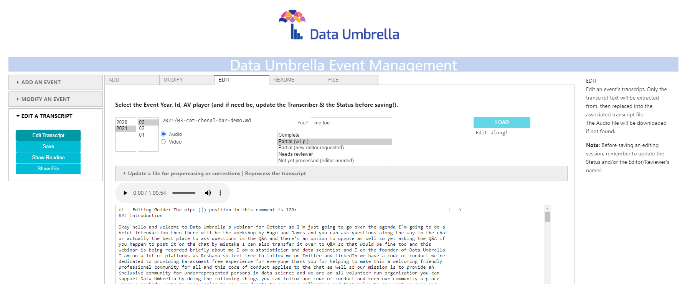

# Data Umbrella Audio Transcription Project - README

### Preview: The EDIT page:


This project's goal is to automate portions of the tasks needed to convert the captions of presentation videos in the Data Umbrella [YouTube channel](https://www.youtube.com/channel/UC4mrlyLbUN2q92W7P0u_Nzg).   
The `pytube` library is used to access the video and its metadata, e.g. audio track and auto-generated captions, which constitute the raw text for the formatted transcripts published by year in the Events Transcripts folder of the [Data Umbrella](https://github.com/data-umbrella/event-transcripts) (DU) repo. 
This automation is implemented via a notebook-base GUI built with the `ipywidgets` library, and can be found in ManageGUI.ipynb in the project notebooks folder (EventManagement/notebooks).
Towards the aim of completing the most teadious task, i.e. editing the transcript, the audio of the video (or the video), is save locally so that it can be played, stopped, and restarted at will in a Jupyter notebook during the reviewing of the transcript. The GUI EDIT page combines all this functionality in a nifty header. Additionally, this page now allows editors to update the csv files used for propercasing and corrections and to re-process the transcript text.

# Transcription by DU repo contributors

Volunteer transcribers indicate their intention to produce or edit the transcript (in part or in whole) by:
* Placing an issue indicating which presentation they chose. Unprocessed presentation transcripts are indicated in the main [Transcripts README file](https://github.com/data-umbrella/event-transcripts/blob/main/README.md).
* Forking the repo and creating a branch for the presentation identifier.

# Here is a brief 'git contribution' commands workflow (amended from [Astropy's documentation](https://astropy.readthedocs.io/en/latest/development/workflow/development_workflow.html#new-to-git)):

0. If not done:
Fork (copy) a GitHub repository in your GitHub space  
Clone the forked GitHub repository on your local system  

1. git fetch 
>gets the latest Repo version, which you will use as the basis for making your changes.

2. git branch 
>makes a logically separate copy of Repo to keep track of your changes.

3. git checkout -b <aname>
>create a branch for each issue/feature you are working on, e.g. 'transcript_<id>'

4. git status 
>see a list of files that have been modified or created.

5. git add 
>stages files you have changed or created for addition to git.

6. git commit -m "<recommended: include a Status from the Status.Enum, e.g. "Partial (w.i.p.)"?>"
> adds your staged changes to the repository.

7. git push 
>copies the changes you committed to GitHub

* See also this brilliant [DEV.to post on fixing git mistakes](https://dev.to/egghead/illustrated-notes-on-fixing-git-mistakes-1c16).

# Functional implementation
The project implements functions related to two roles, which are functional, not authorization-related:
  1. Admin
  2. Editor
    
## 1. Admin's tasks:
### ADD: Add a new entry in the README main table, and setup of the starter transcript Mardkown file.
### MODIFY: Update (change, correct, amend, etc) an entry in the README main table, or update any part of the _header_ in the transcript Mardkown file.
  => This 'Admin.MODIFY' function DOES NOT modify any existing transcript text: the Editor-related functions do that.

## 2. Editor's tasks: EDIT
### The task of the ~~transcriber~~ Editor is to further 'clean up' the initial transcript auto-generated by this project:
* Provide appropriate headers, e.g. "Introduction [by host name] <time stamp>".  
* Apply appropriate capitalization of words (for those not covered in the text cleaning function).  
* Add punctuation. The audio file was not processed at all, so the initial transcript inherits the 'punctuation-free' status of the Google auto-generated captions.
* Modify paragraph breaks. The initial transcript is chunked into paragraphs corresponding to 4 minutes intervals, which is a user parameter, as is the wrapping width.
* Provide additional sections relevant to the presentation, e.g. extra references.  
* Update the presentation transcript Markdown file via a pull request (PR).  

# EventManagement Summary:
## You can:
- Add a new event in the README table & create its associated <year>/<file> with a 'starter transcript'    
- Modify some data in the README table or header of the event <year>/<file>  
- Edit the starter transcript of the event <year>/<file>  
## Here: [Add, Modify or Edit a transcript via GUI](./notebooks/ManageGUI.ipynb)

---    
### Technical Note: To test whether your editing has introduced non-unicode characters, open the file in a notebook cell:
```
from IPython.display import Markdown

Markdown(filename=<filepath>)
```
The current implementation does not decode these characters because the files are directly opened with Markdown (as in the above example), either to render the file, or obtain the Mardkown code _post_ rendering (e.g. Markdown(<file>).data.  See [UnicodeEncodeError](https://wiki.python.org/moin/UnicodeEncodeError).  
